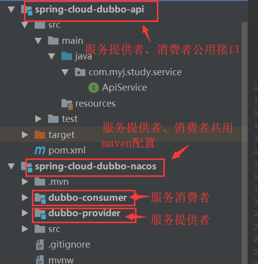
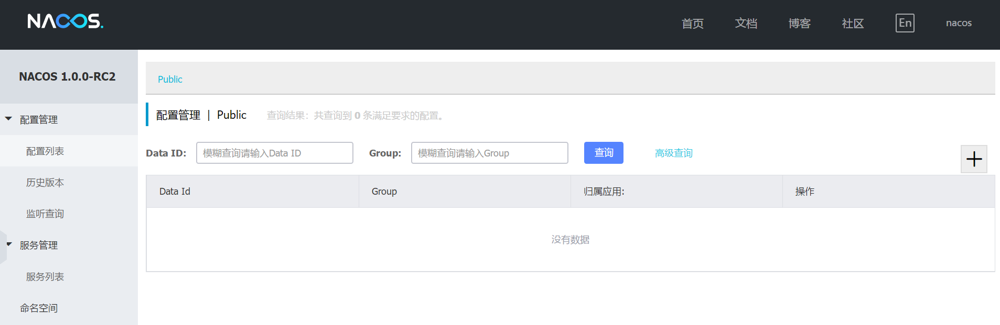
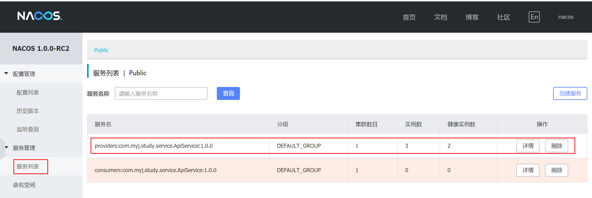

# 使用Nacos作为Dubbo注册中心

​	Dubbo可以使用Redis 、Zookeeper、Nacos作为服务注册中心。目前官方推荐使用Zookeeper作为服务注册中心，但是阿里官方现在开源了[Nacos](https://nacos.io/zh-cn/docs/what-is-nacos.html),并且Nacos同时提供了动态服务发现、服务配置、服务元数据及流量管理的功能。本文就在项目中演示如何使用Nacos作为Dubbo注册中心。

​	因为Dubbo是面向接口编程，所以将工程分为三个模块：**接口工程**、**服务提供者**、**服务消费者**。结构如下：




## 一、准备环境

需先安装并启动Nacos，本文使用的是[nacos-server-1.0.0-RC2](https://github.com/alibaba/nacos/releases/download/1.0.0-RC2/nacos-server-1.0.0-RC2.zip)





## 二、创建公用接口工程

​	创建服务提供者和消费者公用接口工程，在工程中新建接口ApiService：

```java
    /**
     * Dubbo服务提供者个消费者公用接口
     */
    public interface ApiService {

        /**
         * 打印参数值
         *
         * @param param
         * @return
         */
        String sayParam(String param);


        /**
         * 两个数相除
         *
         * @param a
         * @param b
         * @return
         */
        int divide(int a, int b);

    }
```


## 三、创建服务提供者、消费者公用模块

​	因为服务提供者和消费者的maven依赖都是一样的，则先新建一个公用模块工程spring-cloud-dubbo-nacos后再在其项目先新建服务提供者和消费者两个模块。

### 1.  **maven配置文件pom.xml**

```xml
<?xml version="1.0" encoding="UTF-8"?>
<project xmlns="http://maven.apache.org/POM/4.0.0" xmlns:xsi="http://www.w3.org/2001/XMLSchema-instance"
         xsi:schemaLocation="http://maven.apache.org/POM/4.0.0 http://maven.apache.org/xsd/maven-4.0.0.xsd">
    <modelVersion>4.0.0</modelVersion>

    <!--<parent>
            <groupId>com.myj.study</groupId>
            <artifactId>spring-cloud-alibaba</artifactId>
            <version>0.0.1-SNAPSHOT</version>
            <relativePath>../pom.xml</relativePath>
        </parent>-->

    <parent>
        <groupId>org.springframework.boot</groupId>
        <artifactId>spring-boot-starter-parent</artifactId>
        <version>2.1.1.RELEASE</version>
        <relativePath/> <!-- lookup parent from repository -->
    </parent>

    <groupId>com.myj.study</groupId>
    <artifactId>spring-cloud-dubbo-nacos</artifactId>
    <version>0.0.1-SNAPSHOT</version>

    <name>spring-cloud-dubbo-nacos</name>
    <description>使用nacos作为dubbo的注册中心</description>

    <properties>
        <java.version>1.8</java.version>
    </properties>

    <dependencies>
        <dependency>
            <groupId>org.springframework.boot</groupId>
            <artifactId>spring-boot-starter-web</artifactId>
        </dependency>

        <dependency>
            <groupId>com.alibaba.boot</groupId>
            <artifactId>dubbo-spring-boot-starter</artifactId>
            <version>0.2.1-SNAPSHOT</version>
        </dependency>

        <!-- Dubbo -->
        <dependency>
            <groupId>com.alibaba</groupId>
            <artifactId>dubbo</artifactId>
            <version>2.6.5</version>
        </dependency>

        <dependency>
            <groupId>io.netty</groupId>
            <artifactId>netty-all</artifactId>
            <version>4.1.17.Final</version>
        </dependency>

        <!-- Spring Context Extras -->
        <dependency>
            <groupId>com.alibaba.spring</groupId>
            <artifactId>spring-context-support</artifactId>
            <version>1.0.2</version>
        </dependency>

        <dependency>
            <groupId>com.alibaba</groupId>
            <artifactId>dubbo-registry-nacos</artifactId>
            <version>0.0.2</version>
        </dependency>

        <!-- Keep latest Nacos client version -->
        <dependency>
            <groupId>com.alibaba.nacos</groupId>
            <artifactId>nacos-client</artifactId>
            <version>[0.6.1,)</version>
        </dependency>

        <dependency>
            <groupId>org.springframework.boot</groupId>
            <artifactId>spring-boot-starter-test</artifactId>
            <scope>test</scope>
        </dependency>
    </dependencies>


    <build>
        <plugins>
            <plugin>
                <groupId>org.springframework.boot</groupId>
                <artifactId>spring-boot-maven-plugin</artifactId>
            </plugin>
        </plugins>
    </build>

</project>

```

## 四、创建服务提供者

​	在spring-cloud-dubbo-nacos下新建服务提供者Spring Initializr模块dubbo-provider。配置如下

### 1. maven配置文件pom.xml

```xml
	<?xml version="1.0" encoding="UTF-8"?>
<project xmlns="http://maven.apache.org/POM/4.0.0" xmlns:xsi="http://www.w3.org/2001/XMLSchema-instance"
         xsi:schemaLocation="http://maven.apache.org/POM/4.0.0 http://maven.apache.org/xsd/maven-4.0.0.xsd">
    <modelVersion>4.0.0</modelVersion>

    <parent>
        <groupId>com.myj.study</groupId>
        <artifactId>spring-cloud-dubbo-nacos</artifactId>
        <version>0.0.1-SNAPSHOT</version>
        <relativePath>../pom.xml</relativePath>
    </parent>

    <groupId>com.myj.study</groupId>
    <artifactId>dubbo-provider</artifactId>
    <version>0.0.1-SNAPSHOT</version>
    <name>dubbo-provider</name>
    <description>dubbo服务提供者</description>

    <properties>
        <java.version>1.8</java.version>
    </properties>

    <dependencies>

        <dependency>
            <groupId>${project.groupId}</groupId>
            <artifactId>spring-cloud-dubbo-api</artifactId>
            <version>${project.version}</version>
        </dependency>

    </dependencies>

    <build>
        <plugins>
            <plugin>
                <groupId>org.springframework.boot</groupId>
                <artifactId>spring-boot-maven-plugin</artifactId>
            </plugin>
        </plugins>
    </build>

</project>

```

### 2. 属性配置文件

在application.properties中增加如下属性配置

```properties
spring.application.name=nacos-dubbo-provider

#是否启动QoS
dubbo.application.qos-enable=false
#配置包扫描
dubbo.scan.base-packages=com.myj.study

#传输协议
dubbo.protocol.name=dubbo

#随机端口
dubbo.protocol.port=-1

#nacos地址
dubbo.registry.address=nacos://127.0.0.1:8848

```

### 3. 创建接口实现类

创建服务提供类继承ApiService类，并实现其方法，并在类上使用@Service注解标识该类是服务提供者。

```java
package com.myj.study.dubboprovider.service.impl;

import com.alibaba.dubbo.config.annotation.Service;
import com.alibaba.dubbo.rpc.RpcContext;
import com.myj.study.service.ApiService;

@Service(version = "1.0.0")
public class ApiServiceImpl implements ApiService {

    @Override
    public String sayParam(String param) {
        int port = RpcContext.getContext().getLocalPort();
        String result = String.format("[port : %d] ApiService.sayParam( param= %s )", port, param);
        System.out.println(result);
        return result;
    }

    @Override
    public int divide(int a, int b) {
        int port = RpcContext.getContext().getLocalPort();
        int result = a / b;
        String str = String.format("[port : %s] CalculateService.divide( a= %d, b = %d ) = %d", port, a, b, result);
        System.out.println(str);
        return result;
    }
}
```

### 4. 修改应用启动类

```java
修改应用启动的主类如下：

package com.myj.study.dubboprovider;

import org.springframework.boot.WebApplicationType;
import org.springframework.boot.autoconfigure.SpringBootApplication;
import org.springframework.boot.builder.SpringApplicationBuilder;

@SpringBootApplication
public class NacosDubboProviderApplication {

    public static void main(String[] args) {
        new SpringApplicationBuilder(NacosDubboProviderApplication.class).
                web(WebApplicationType.NONE).run(args);
    }

}


```

### 5. 启动应用

运行NacosDubboProviderApplication类中的main方法，启动两个实例。



​	

## 五、创建服务消费者

​	服务提供者搭建完成以后在spring-cloud-dubbo-nacos下新建服务提供者Spring Initializr模块dubbo-consumer。配置如下

### 1. maven配置文件pom.xml

```xml
<?xml version="1.0" encoding="UTF-8"?>
<project xmlns="http://maven.apache.org/POM/4.0.0" xmlns:xsi="http://www.w3.org/2001/XMLSchema-instance"
         xsi:schemaLocation="http://maven.apache.org/POM/4.0.0 http://maven.apache.org/xsd/maven-4.0.0.xsd">
    <modelVersion>4.0.0</modelVersion>

    <parent>
        <groupId>com.myj.study</groupId>
        <artifactId>spring-cloud-dubbo-nacos</artifactId>
        <version>0.0.1-SNAPSHOT</version>
        <relativePath>../pom.xml</relativePath>
    </parent>

    <groupId>com.myj.study</groupId>
    <artifactId>dubbo-consumer</artifactId>
    <version>0.0.1-SNAPSHOT</version>
    <name>dubbo-consumer</name>
    <description>dubbo服务消费者</description>

    <properties>
        <java.version>1.8</java.version>
    </properties>

    <dependencies>

        <dependency>
            <groupId>${project.groupId}</groupId>
            <artifactId>spring-cloud-dubbo-api</artifactId>
            <version>${project.version}</version>
        </dependency>

    </dependencies>

    <build>
        <plugins>
            <plugin>
                <groupId>org.springframework.boot</groupId>
                <artifactId>spring-boot-maven-plugin</artifactId>
            </plugin>
        </plugins>
    </build>

</project>

```

### 2. 属性配置文件

在application.properties中增加如下属性配置，因为是服务消费者，只需要配置dubbo的注册地址即可。

```properties
spring.application.name=nacos-dubbo-consumer

#nacos地址
dubbo.registry.address=nacos://127.0.0.1:8848

```

### 3. 创建Controller

创建Controller类消费服务提供者提供的服务，@Reference注解标识消费者，其中的version属性需与服务提供者的version保持一致。

```java
package com.myj.study.dubboconsumer.controller;

import com.alibaba.dubbo.config.annotation.Reference;
import com.myj.study.service.ApiService;
import org.springframework.web.bind.annotation.GetMapping;
import org.springframework.web.bind.annotation.RequestParam;
import org.springframework.web.bind.annotation.RestController;

@RestController
public class ApiController {

    /**
     * Reference注解标识服务消费者，version需对应于提供者的版本
     */
    @Reference(version = "1.0.0" , loadbalance = "sss")
    private ApiService apiService;

    @GetMapping("/sayParam")
    public String sayParam(@RequestParam String param) {
        return apiService.sayParam(param);
    }


    @GetMapping("/divide")
    public int divide(@RequestParam int a, @RequestParam int b) {
        return apiService.divide(a, b);
    }

}

```

### 4. 修改应用启动类

```java
修改应用启动的主类如下：

package com.myj.study.dubboconsumer;

import org.springframework.boot.autoconfigure.SpringBootApplication;
import org.springframework.boot.builder.SpringApplicationBuilder;

@SpringBootApplication
public class NacosDubboConsumerApplication {

    public static void main(String[] args) {
        new SpringApplicationBuilder(NacosDubboConsumerApplication.class)
                .run(args);
    }

}


```

### 5. 启动应用

运行NacosDubboConsumerApplication类中的main方法，启动应用，在浏览器中输入url(http://127.0.0.1:8080/sayParam?param=Myron)访问应用，刷新可以看到服务提供者不同实例返回的结果。

20880端口：


20882端口：	

