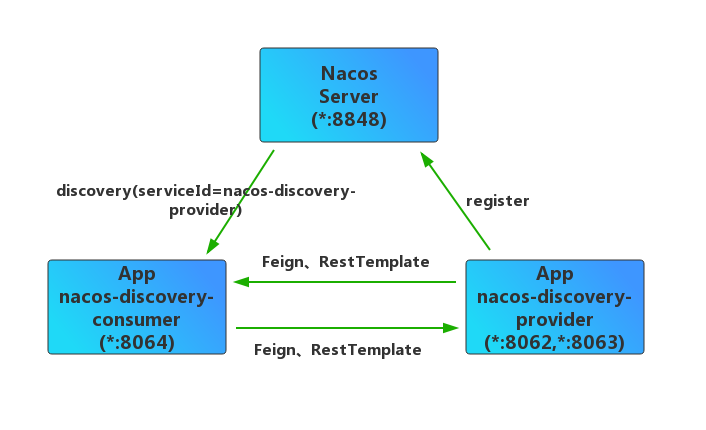
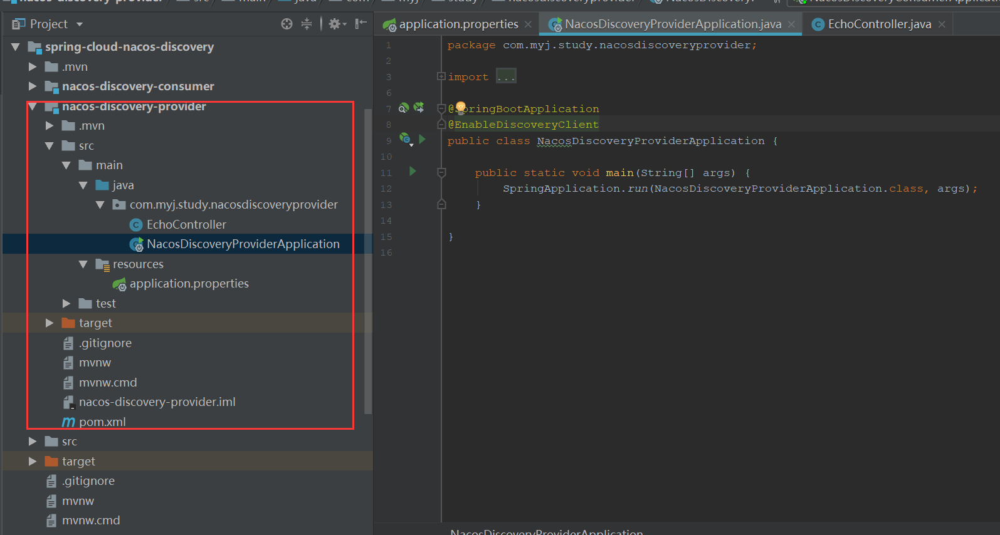
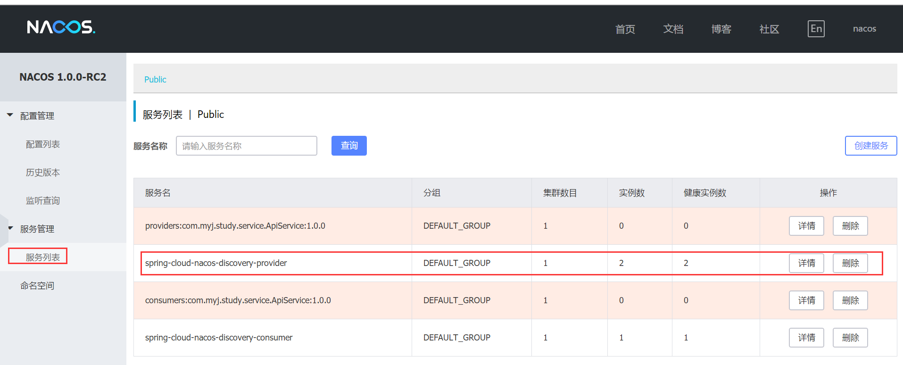
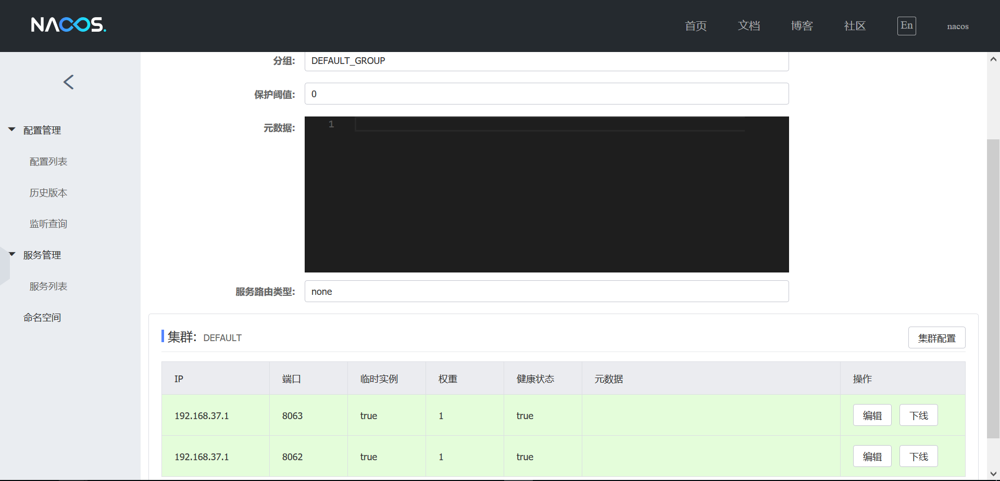
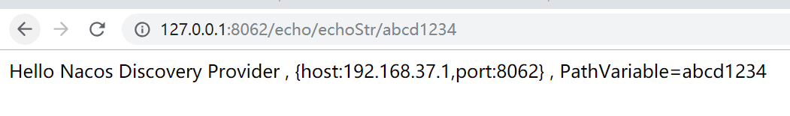
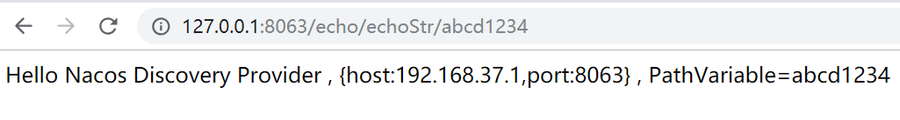
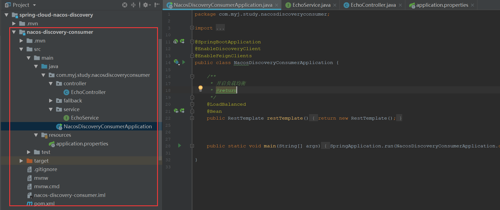
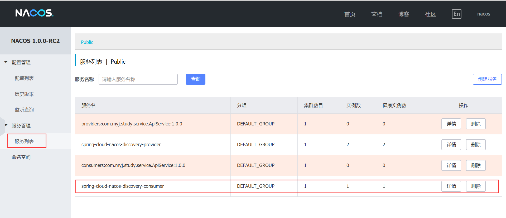
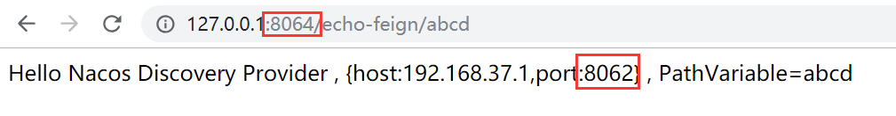
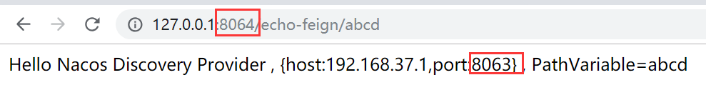

​	Nacos实现了动态服务发现和管理（Spring Cloud Eureka的功能）、服务配置管理（Spring Cloud Config）的功能，并且提供了web界面操作，这使管理微服务应用变得更简单，同时官方说Nacos是经受了双十一的考验，本文通过 Nacos Server 和 spring-cloud-starter-alibaba-nacos-discovery 演示如何在Spring Cloud项目中启用 Nacos 的服务的注册与发现功能，如下图示:



本文分别创建两个工程服务提供者(spring-cloud-nacos-discovery-provider)和服务消费者(spring-cloud-nacos-discovery-consumer)演示如何使用Nacos 的服务的注册与发现功能.

## 一、安装并启动Nacos
下载并启动Nacos Server

[官方安装文档](https://nacos.io/en-us/docs/quick-start.html)

[单节点安装文档](http://note.youdao.com/noteshare?id=f6e91094a9bb2438fc4ef9ebaa303c50&sub=200FA8E39741467BA51CF8639828E10A)

[集群安装文档](http://note.youdao.com/noteshare?id=9d997f46b1f5e2ad433636f09394ed96&sub=BA6FC6D7612945F8A8823042177B6E51)


本文使用Nacos集群做测试，使用本地模式和集群模式唯一的区别是：

```properties
#单节点
spring.cloud.nacos.discovery.server-addr=myj01:8848

#集群模式
spring.cloud.nacos.discovery.server-addr=myj01:8848,myj02:8848,myj03:8848
```


## 二、创建服务提供者工程

创建服务提供者工程（工程名：nacos-discovery-provider，开启两个实例：端口分别为8062、8063）

项目结构如下图




### 2.1 修改maven配置文件
创建应用后修改maven的pom.xml的配置文件如下,其中需要注意spring-boot-starter-parent的版本，目前使用高版本无法注册到Nacos

``` xml
<?xml version="1.0" encoding="UTF-8"?>
<project xmlns="http://maven.apache.org/POM/4.0.0" xmlns:xsi="http://www.w3.org/2001/XMLSchema-instance"
         xsi:schemaLocation="http://maven.apache.org/POM/4.0.0 http://maven.apache.org/xsd/maven-4.0.0.xsd">
    <modelVersion>4.0.0</modelVersion>

    <parent>
        <groupId>org.springframework.boot</groupId>
        <artifactId>spring-boot-starter-parent</artifactId>
        <!--<version>2.1.3.RELEASE</version>-->
        <version>2.0.4.RELEASE</version>
        <relativePath/> <!-- lookup parent from repository -->
    </parent>

    <groupId>com.myj.study</groupId>
    <artifactId>nacos-discovery-provider</artifactId>
    <version>0.0.1-SNAPSHOT</version>
    <name>nacos-discovery-provider</name>
    <description>Nacos服务提供者</description>

    <properties>
        <java.version>1.8</java.version>
    </properties>

    <dependencyManagement>
        <dependencies>
            <dependency>
                <groupId>org.springframework.cloud</groupId>
                <artifactId>spring-cloud-alibaba-dependencies</artifactId>
                <version>0.2.1.RELEASE</version>
                <type>pom</type>
                <scope>import</scope>
            </dependency>
        </dependencies>
    </dependencyManagement>

    <dependencies>
        <dependency>
            <groupId>org.springframework.boot</groupId>
            <artifactId>spring-boot-starter-web</artifactId>
        </dependency>

        <dependency>
            <groupId>org.springframework.cloud</groupId>
            <artifactId>spring-cloud-starter-alibaba-nacos-discovery</artifactId>
        </dependency>

        <dependency>
            <groupId>org.springframework.boot</groupId>
            <artifactId>spring-boot-starter-test</artifactId>
            <scope>test</scope>
        </dependency>
    </dependencies>

    <build>
        <plugins>
            <plugin>
                <groupId>org.springframework.boot</groupId>
                <artifactId>spring-boot-maven-plugin</artifactId>
            </plugin>
        </plugins>
    </build>

</project>

```

### 2.2 修改properties配置文件

修改应用的application.properties配置文件如下：

```properties
server.port=8062
#server.port=8063
spring.application.name=spring-cloud-nacos-discovery-provider

#nacos server地址
spring.cloud.nacos.discovery.server-addr=127.0.0.1:8848
management.endpoints.web.exposure.include=*

```


### 2.3 创建Controller提供服务

```java

@RestController
@RequestMapping(value = "/echo")
public class EchoController {

    @Autowired
    Registration registration; // 服务注册

    @Autowired
    DiscoveryClient discoveryClient;

    /**
     * 打印请求的服务的ip和端口、请求内容
     * @param string
     * @return
     */
    @RequestMapping(value = "/echoStr/{string}", method = RequestMethod.GET)
    public String echoStr(@PathVariable String string) {
        return String.format("Hello Nacos Discovery Provider , {host:%s,port:%s} , PathVariable=%s",
                registration.getHost(), registration.getPort(), string);
    }

    /**
     * 打印请求的服务的ip和端口、请求的两个数相除的结果
     * @param a
     * @param b
     * @return
     */
    @RequestMapping(value = "/divide", method = RequestMethod.GET)
    public String divide(@RequestParam Integer a, @RequestParam Integer b) {
        return String.format("Hello Nacos Discovery Provider , {host:%s,port:%s} , %d/%d=%s",
                registration.getHost(), registration.getPort(), a, b, String.valueOf(a / b));
    }

}


```

### 2.4 增加@EnableDiscoveryClient注解
在Spring应用的启动类上增加@EnableDiscoveryClient注解，可以看到在Eureka中也是该注解，因为该注解是Spring Cloud提供，Eureka和Nacos都是实现了Spring Cloud的org.springframework.cloud.client.discovery.DiscoveryClient接口。

```java

@SpringBootApplication
@EnableDiscoveryClient
public class SpringCloudNacosDiscoveryProviderApplication {

    public static void main(String[] args) {
        SpringApplication.run(SpringCloudNacosDiscoveryProviderApplication.class, args);
    }

}

```

### 2.5 启动应用
分别修改application.properties中的server.port的值为8062和8063启动应用的两个实例（目的是在服务消费者上使用负载均衡的功能）。

启动后查看Nacos Server的服务列表控制台可以看到服务已成功注册。



可以点击详情查看服务的详细信息



### 2.6 验证服务

#### 2.6.1 验证8062接口提供的服务

访问8062对应的服务(http://127.0.0.1:8062/echo/echoStr/abcd1234)结果如下：



#### 2.6.2 验证8063接口提供的服务

访问8063对应的服务(http://127.0.0.1:8063/echo/echoStr/abcd1234)结果如下：



## 三、创建服务消费者工程

现在服务提供者已成功创建。现在开始创建服务消费者消费提供者的服务nacos-discovery-consumer，并且在消费者中引入了负载均衡和熔断工具（spring-cloud-starter-openfeign和spring-cloud-starter-alibaba-sentinel），其中sentinel在后续介绍，下面是创建的详细步骤。

项目结构如下图




### 3.1 修改maven配置文件

创建应用后修改maven的pom.xml的配置文件如下


```xml
<?xml version="1.0" encoding="UTF-8"?>
<project xmlns="http://maven.apache.org/POM/4.0.0" xmlns:xsi="http://www.w3.org/2001/XMLSchema-instance"
         xsi:schemaLocation="http://maven.apache.org/POM/4.0.0 http://maven.apache.org/xsd/maven-4.0.0.xsd">
    <modelVersion>4.0.0</modelVersion>

    <parent>
        <groupId>org.springframework.boot</groupId>
        <artifactId>spring-boot-starter-parent</artifactId>
        <version>2.0.4.RELEASE</version><!-- 测试发现只有在该版本中自动刷新有效 -->
        <!--<version>2.1.2.RELEASE</version>-->
        <relativePath/>
    </parent>

    <groupId>com.myj.study</groupId>
    <artifactId>nacos-discovery-consumer</artifactId>
    <version>0.0.1-SNAPSHOT</version>
    <name>nacos-discovery-consumer</name>
    <description>Nacos服务消费者</description>

    <properties>
        <java.version>1.8</java.version>

        <!-- Dependency Versions -->
        <spring-cloud-commons.version>2.1.0.RELEASE</spring-cloud-commons.version>
        <spring-cloud-netflix.version>2.0.3.RELEASE</spring-cloud-netflix.version>
        <spring-cloud-openfeign.version>2.0.3.RELEASE</spring-cloud-openfeign.version>

        <junit.version>4.12</junit.version>

    </properties>

    <dependencyManagement>
        <dependencies>
            <dependency>
                <groupId>org.springframework.cloud</groupId>
                <artifactId>spring-cloud-alibaba-dependencies</artifactId>
                <version>0.2.1.RELEASE</version>
                <type>pom</type>
                <scope>import</scope>
            </dependency>
        </dependencies>
    </dependencyManagement>

    <dependencies>
        <dependency>
            <groupId>org.springframework.boot</groupId>
            <artifactId>spring-boot-starter-web</artifactId>
        </dependency>

        <dependency>
            <groupId>org.springframework.cloud</groupId>
            <artifactId>spring-cloud-starter-alibaba-nacos-discovery</artifactId>
        </dependency>

        <dependency>
            <groupId>org.springframework.boot</groupId>
            <artifactId>spring-boot-starter-actuator</artifactId>
        </dependency>

        <dependency>
            <groupId>org.springframework.cloud</groupId>
            <artifactId>spring-cloud-starter-openfeign</artifactId>
            <version>${spring-cloud-openfeign.version}</version>
        </dependency>

        <dependency>
            <groupId>org.springframework.cloud</groupId>
            <artifactId>spring-cloud-starter-alibaba-sentinel</artifactId>
        </dependency>

        <dependency>
            <groupId>org.springframework.boot</groupId>
            <artifactId>spring-boot-starter-test</artifactId>
            <scope>test</scope>
        </dependency>
    </dependencies>


    <build>
        <plugins>
            <plugin>
                <groupId>org.springframework.boot</groupId>
                <artifactId>spring-boot-maven-plugin</artifactId>
            </plugin>
        </plugins>
    </build>

</project>

```
### 3.2 修改properties配置文件

修改消费者应用的application.properties配置文件如下：


```properties

spring.application.name=spring-cloud-nacos-discovery-consumer
server.port=8064
management.endpoints.web.exposure.include=*
spring.cloud.nacos.discovery.server-addr=127.0.0.1:8848

#启用sentinel熔断
feign.sentinel.enabled=true

#sentinel dashboard地址
spring.cloud.sentinel.transport.dashboard=localhost:8080
spring.cloud.sentinel.eager=true


```

### 3.3 创建Service访问消费服务提供者的服务

创建Service并且使用FeignClient注解标识服务提供者的服务名。

```java

@FeignClient(name = "spring-cloud-nacos-discovery-provider",
        fallback = EchoServiceFallback.class)
public interface EchoService {

    /**
     * 请求服务资源
     *
     * @param str
     * @return
     */
    @RequestMapping(value = "/echo/echoStr/{str}", method = RequestMethod.GET)
    String echoStr(@PathVariable("str") String str);

    /**
     * 请求服务资源
     *
     * @param a
     * @param b
     * @return
     */
    @RequestMapping(value = "/echo/divide", method = RequestMethod.GET)
    String divide(@RequestParam("a") Integer a, @RequestParam("b") Integer b);

    /**
     * 请求服务资源
     *
     * @return
     */
    @RequestMapping(value = "/notFound", method = RequestMethod.GET)
    String notFound();
}


```

创建当服务提供者的服务报错时的熔断处理类，该类需要实现接口EchoService，并将其注册为一个bean。

```java

@Component
public class EchoServiceFallback implements EchoService {

    @Override
    public String echoStr(@PathVariable("str") String str) {
        return "echoStr fallback";
    }

    @Override
    public String divide(@RequestParam Integer a, @RequestParam Integer b) {
        return "divide fallback";
    }

    @Override
    public String notFound() {
        return "notFound fallback";
    }
}


```


### 3.4 创建Controller

创建Controller通过EchoService访问服务提供者提供的服务。

```java
@RestController
public class EchoController {

    @Autowired
    private RestTemplate restTemplate;

    @Autowired
    private EchoService echoService;

    @Autowired
    private DiscoveryClient discoveryClient;

    /**
     * 使用RestTemplate请求资源
     *
     * @param str
     * @return
     */
    @RequestMapping(value = "/echo-rest/{str}", method = RequestMethod.GET)
    public String rest(@PathVariable String str) {
        return restTemplate.getForObject("http://spring-cloud-nacos-discovery-provider/echo/echoStr/" + str,
                String.class);
    }

    /**
     * 请求服务提供者，请求一个不存在的资源
     *
     * @return
     */
    @RequestMapping(value = "/notFound-feign", method = RequestMethod.GET)
    public String notFound() {
        return echoService.notFound();
    }

    /**
     * 请求服务提供者，调用服务提供者的/echo/divide
     *
     * @param a
     * @param b
     * @return
     */
    @RequestMapping(value = "/divide-feign", method = RequestMethod.GET)
    public String divide(@RequestParam Integer a, @RequestParam Integer b) {
        return echoService.divide(a, b);
    }

    /**
     * 请求服务提供者，调用服务提供者的/echo/echoStr/{str}
     *
     * @param str
     * @return
     */
    @RequestMapping(value = "/echo-feign/{str}", method = RequestMethod.GET)
    public String feign(@PathVariable String str) {
        return echoService.echoStr(str);
    }

    /**
     * 查找服务注册中心的指定服务信息
     *
     * @param service
     * @return
     */
    @RequestMapping(value = "/services/{service}", method = RequestMethod.GET)
    public Object client(@PathVariable String service) {
        return discoveryClient.getInstances(service);
    }

    /**
     * 查看服务注册中心的所有服务
     *
     * @return
     */
    @RequestMapping(value = "/services", method = RequestMethod.GET)
    public Object services() {
        return discoveryClient.getServices();
    }

}


```

### 3.5 修改启动类

在spring启动类上增加@EnableDiscoveryClient注解、@EnableFeignClients注解开启服务注册、负载均衡等。


```java

@SpringBootApplication
@EnableDiscoveryClient
@EnableFeignClients
public class SpringCloudNacosDiscoveryConsumerApplication {

    /**
     * 开启负载均衡
     * @return
     */
    @LoadBalanced
    @Bean
    public RestTemplate restTemplate() {
        return new RestTemplate();
    }


    public static void main(String[] args) {
        SpringApplication.run(SpringCloudNacosDiscoveryConsumerApplication.class, args);
    }

}

```

### 3.6 启动应用

运行Spring Boot应用的mian方法启动应用。刷新Nacos Server的页面查看服务列表。



### 3.7 验证消费者应用

访问消费者的接口http://127.0.0.1:8064/echo-feign/abcd，可以看到服务提供者提供的服务，同时刷新可以看到分别是服务提供者8062和8063两个实例提供服务，说明已经达到负载均衡的目的。



在刷新页面发现是由8063提供服务




